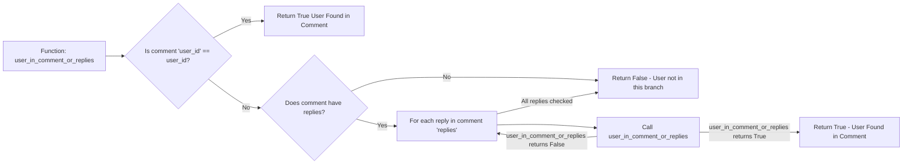

# Mermaid

```mermaid
graph LR
    A[Function: user_in_comment_or_replies] --> B{Is comment 'user_id' == user_id?};
    B -- Yes --> C[Return True User Found in Comment];
    B -- No --> D{Does comment have replies?};
    D -- No --> E[Return False - User not in this branch];
    D -- Yes --> F[For each reply in comment 'replies'];
    F --> G[Call user_in_comment_or_replies];
    G -- user_in_comment_or_replies returns True --> H[Return True - User Found in Comment];
    G -- user_in_comment_or_replies returns False --> F;
    F -- All replies checked --> E;
```
