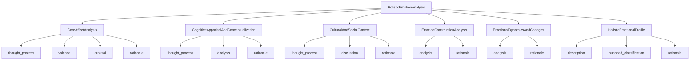

```mermaid
graph TD;
    A[HolisticEmotionAnalysis] --> B[CoreAffectAnalysis]
    A --> C[CognitiveAppraisalAndConceptualization]
    A --> D[CulturalAndSocialContext]
    A --> E[EmotionConstructionAnalysis]
    A --> F[EmotionalDynamicsAndChanges]
    A --> G[HolisticEmotionalProfile]

    B --> B1[thought_process]
    B --> B2[valence]
    B --> B3[arousal]
    B --> B4[rationale]

    C --> C1[thought_process]
    C --> C2[analysis]
    C --> C3[rationale]

    D --> D1[thought_process]
    D --> D2[discussion]
    D --> D3[rationale]

    E --> E1[analysis]
    E --> E2[rationale]

    F --> F1[analysis]
    F --> F2[rationale]

    G --> G1[description]
    G --> G2[nuanced_classification]
    G --> G3[rationale]
```